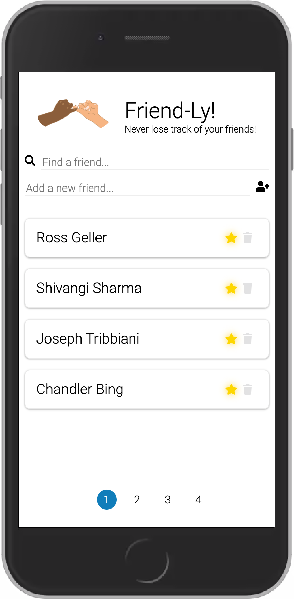

# Friend-ly

Your friendly neighborhood application!

This is a simple end-to-end application created using [React](https://reactjs.org/) and [Redux](https://redux.js.org/). It is hosted on [Google Firebase](https://firebase.google.com/). 

 

## Hosting
This application is currently hosted on [Friend-ly](https://friend-ly-d2f6b.web.app/).

 

## How to use?
To make this application work on your local machine, complete the following steps:
1. Clone this project on your local machine inside a suitable folder.
2. Navigate to the folder using a terminal.
3. Execute `npm install` to install all the dependencies.
4. Execute `npm start` to start the application.

 

## Contact

You can get in touch with the developer by dropping an email at [shahrushabh1993@gmail.com](mailto:shahrushabh1993@gmail.com)